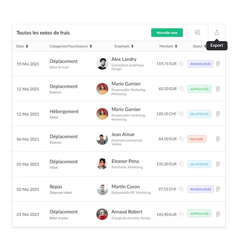

# [Page Objects Model in Selenium](https://selenium-python.readthedocs.io/page-objects.html) with [unittest](https://docs.python.org/3/library/unittest.html?highlight=unit#module-unittest)  
***by [BelR](https://github.com/belr20) with*** [](https://www.python.org/downloads/release/python-3106/)


Page Objects Model (POM) is a design pattern that you can apply to develop web applications efficient test automation :
* Easy to read test cases
* Creating reusable code that can share across multiple test cases
* Reducing the amount of duplicated code
* If the user interface changes, the fix needs changes in only one place

## Python architecture

Basically POM consists of that each page is inherited from a base class which includes basic functionalities for all pages.  
If you have some new functionality that each page has, you can simple add it to the base class.

`BasePage` class includes basic functionality and driver initialization
```python
# base_page.py
class BasePage(object):
    def __init__(self, driver, base_url='https://qsi-conseil.kiwihr.com'):
        self.base_url = base_url
        self.driver = driver
        self.timeout = 30

    def find_element(self, *locator):
        return self.driver.find_element(*locator)
```

`MainPage` is derived from the `BasePage` class, it contains methods related to this page, which will be used to create test steps.
```python
# main_page.py
class MainPage(BasePage):
    def __init__(self, driver):
        self.locator = MainPageLocators
        super().__init__(driver)  # Python3 version

    def check_page_loaded(self, url):
        # return True if self.find_element(*self.locator.LOGO) else False
        return True if self.get_url() == url else False
```

When you want to write tests, you should derive your test class from `BaseTest` which holds basic functionalities for your tests.  
Then you can call pages and related methods in accordance with the steps in the test cases.
```python
class TestLogInPage(BaseTest):

    def test_login_with_valid_user(self):
        print("\n" + str(test_cases(4)))
        login_page = LogInPage(self.driver)
        login_page = login_page.click_sign_in_button()
        result = login_page.login_with_valid_user("valid_user")
        self.assertIn("https://qsi-conseil.kiwihr.com/dashboard", result.get_url())
```

## KiwiHR use case

Proposed by [@Abdessalam-Mouttaki](https://github.com/Abdessalam-Mouttaki) from [QSI Conseil](https://qsiconseil.ma/) :pray:  
This use case consists of creating an expense in KiwiHR application :



You can get a free instance for 14 days [here](https://kiwihr.com/fr/inscription).  
Then you have to copy/paste `.env.example` to `.env` & modify the corresponding variables with your :
* KiwiHR instance URL
* KiwiHR username/email
* KiwiHR password

`supplier`, `purchase_date` & `amount` of the expense that will be created are accessible in `tests\test_nouvelle_note_de_frais_page.py`

## Environment

- [ ] First clone this repository (you can get help [here](https://docs.github.com/en/repositories/creating-and-managing-repositories/cloning-a-repository))
```sh
git clone https://github.com/belr20/selenium-page-objects-model-with-unittest.git
cd selenium-page-objects-model-with-unittest
```

- [ ] Then you should create & activate a virtual environment called [venv](https://docs.python.org/3/library/venv.html)
```sh
python -m venv venv
source venv/bin/activate
```

- [ ] Finally install dependencies
```sh
python -m pip install --upgrade pip wheel setuptools
pip install -r requirements.txt
```

## Running Tests

- [ ] If you want to run all tests
```sh
python -m unittest
```

- [ ] If you want to run all tests with HTML report available in `reports` folder
```sh
python tests/base_test.py
```

- [ ] If you want to run just a class
```sh
python -m unittest tests.test_login_page.TestLogInPage
```

- [ ] If you want to run just a test method
```sh
python -m unittest tests.test_login_page.TestLogInPage.test_login_with_valid_user
```

## Resources

* [unittest | python.org](https://docs.python.org/3/library/unittest.html?highlight=unit#module-unittest)
* [HtmlTestRunner | GitHub](https://github.com/oldani/HtmlTestRunner)
* [Selenium Page Objects Model](https://selenium-python.readthedocs.io/page-objects.html)
* [Cloning a repository | GitHub](https://docs.github.com/en/repositories/creating-and-managing-repositories/cloning-a-repository)
* [Python virtual env | python.org](https://docs.python.org/3/library/venv.html)
* [KiwiHR inscription | kiwihr.com](https://kiwihr.com/fr/inscription)
