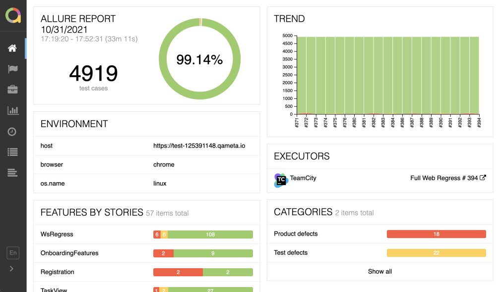

# [Page Objects Model in Selenium](https://selenium-python.readthedocs.io/page-objects.html) with [pytest](https://docs.pytest.org/en/stable/contents.html) + [allure](https://qameta.io/allure-report/)  


Page Objects Model (POM) is a design pattern that you can apply to develop web applications efficient test automation :

* Easy to read test cases
* Creating reusable code that can share across multiple test cases
* Reducing the amount of duplicated code
* If the user interface changes, the fix needs changes in only one place


## Environment

* [ ] First clone this repository (you can get help [here](https://docs.github.com/en/repositories/creating-and-managing-repositories/cloning-a-repository))

```sh
git clone https://github.com/logras/Lusha_2025.git
```

* [ ] Then you should create & activate a virtual environment called [venv](https://docs.python.org/3/library/venv.html)

```sh
python -m venv venv
source venv/bin/activate  # On Linux
.\venv\Scripts\activate  # On Windows
```

* [ ] Finally install dependencies

```sh
pip install -r requirements.txt
```

## Running Tests


```sh
python -m pytest
```

* [ ] If you want to run all tests with [allure](https://pypi.org/project/allure-pytest/) report available in `reports/allure-results` folder

```sh
pytest --alluredir=reports/allure-results
allure serve reports/allure-results
```



:warning: How to install allure CLI [here](https://docs.qameta.io/allure-report/#_installing_a_commandline)

* [ ] If you want to run all tests with HTML report available in `reports` folder

```sh
python tests/base_test.py
```

* [ ] If you want to run just a class

```sh
python -m unittest tests.test_login_page.TestLogInPage
```

* [ ] If you want to run just a test method

```sh
python -m unittest tests.test_login_page.TestLogInPage.test_login_with_valid_user
```

* [ ] Default browser is `chrome`, if you want to run test with `firefox`, prepend CLI with setting `BROWSER` to `'firefox'`

  * On Linux

    ```sh
    BROWSER='firefox' python -m pytest
    ```

  * On Windows CMD

    ```cmd
    set BROWSER = 'firefox'
    python -m pytest
    ```

  * On PowerShell

    ```pwsh
    $Env:BROWSER = 'firefox'
    python -m pytest
    ```

* [ ] Default browser is `chrome`, if you want to run test with `edge`, prepend CLI with setting `BROWSER` to `'edge'`

  * On Linux

    ```sh
    BROWSER='edge' python -m pytest
    ```

  * On Windows CMD

    ```cmd
    set BROWSER = 'edge'
    python -m pytest
    ```

  * On PowerShell

    ```pwsh
    $Env:BROWSER = 'edge'
    python -m pytest
    ```

## Parallel Test Execution

To speed up test execution, this project now supports running tests in parallel using pytest-xdist.

### Running Tests in Parallel

* [ ] To run tests in parallel with auto-detected number of workers:

```sh
python -m pytest -n auto
```

* [ ] To run tests in parallel with a specific number of workers:

```sh
python -m pytest -n 4
```

* [ ] To run tests in parallel with a specific distribution mode:

```sh
python -m pytest -n 4 --dist=loadscope
```

### Using Provided Scripts

The project includes convenience scripts for different parallel testing scenarios:

* [ ] Basic parallel test execution:

```sh
python3 scripts/run_parallel_tests.py [num_workers]
```

* [ ] Running apply CV tests in parallel:

```sh
python3 scripts/run_parallel_apply_cv.py [num_workers]
```

* [ ] Running parameterized tests in parallel:

```sh
python3 scripts/run_parallel_parameterized.py [num_workers]
```

### IDE Compatibility for Test Execution

When using PyCharm or other IDEs to run individual tests, you may encounter conflicts with the parallel execution settings. We've provided a helper script that allows running specific tests with custom options:

* [ ] Running a specific test with IDE compatibility:

```sh
python3 scripts/run_test_in_ide.py tests/test_apply_cv.py::TestHomePage::test_apply_cv_to_rnd
```

* [ ] Running with additional options:

```sh
python3 scripts/run_test_in_ide.py tests/test_apply_cv.py -m nondestructive
```

For more detailed information on parallel test execution, see [docs/parallel_testing.md](docs/parallel_testing.md).

## Resources

* [Cloning a repository | GitHub](https://docs.github.com/en/repositories/creating-and-managing-repositories/cloning-a-repository)
* [Creation of virtual environments | docs.python.org](https://docs.python.org/3/library/venv.html)

<br/>

* [Python Decouple | PyPI](https://pypi.org/project/python-decouple/)

<br/>

* [pytest | PyPI](https://pypi.org/project/pytest/)
* [HtmlTestRunner | PyPI](https://pypi.org/project/html-testRunner/)
* [Unit testing framework | docs.python.org](https://docs.python.org/3/library/unittest.html?highlight=unit#module-unittest)
* [How to use unittest-based tests with pytest | docs.pytest.org](https://docs.pytest.org/en/stable/how-to/unittest.html#unittest-testcase)

<br/>

* [Selenium | PyPI](https://pypi.org/project/selenium/)
* [Selenium pytest plugin | PyPI](https://pypi.org/project/pytest-selenium/)
* [Webdriver Manager for Python | PyPI](https://pypi.org/project/webdriver-manager/)
* [Selenium with Python | Page Objects Model | selenium-python.readthedocs.io](https://selenium-python.readthedocs.io/page-objects.html)

<br/>

* [Allure Pytest Plugin | PyPI](https://pypi.org/project/allure-pytest/)
* [Allure Python Integrations | GitHub](https://github.com/allure-framework/allure-python)
* [Allure Framework | CLI install | docs.qameta.io](https://docs.qameta.io/allure-report/#_installing_a_commandline)

<br/>

* [pytest-xdist | PyPI](https://pypi.org/project/pytest-xdist/)
* [pytest-xdist Documentation](https://pytest-xdist.readthedocs.io/en/latest/)
